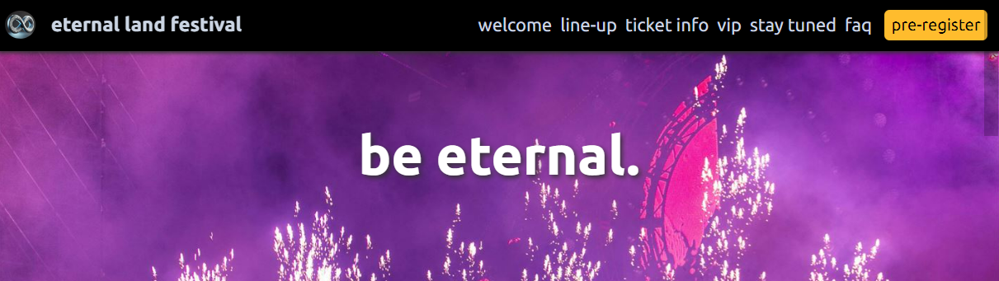
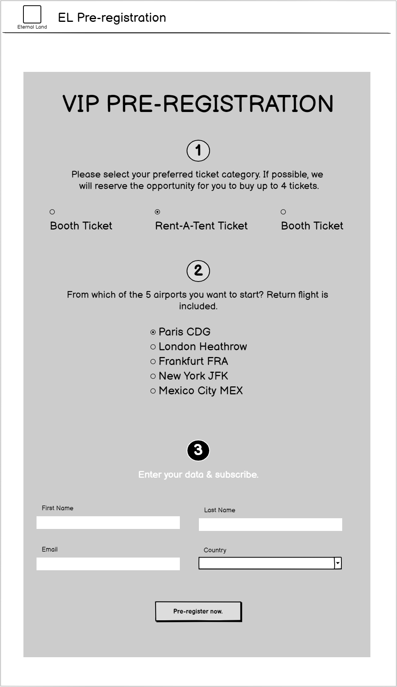

# Eternal Land Festival
(Developer: Felix Lehmann)

This website promotes the first state of an EDM Festival called "Eternal Land Festival" - in the middle of the Atlantic Ocean. Many photos and one video of the last years' events will motivate fans of electronic music to participate. For three days, world famous DJs will perform their latest sets to give the audience an unforgettable experience. The line-up on the website shall support the motivation process. It helps to decide rather quickly.  

The festival will offer VIP tickets. They are more expensive but provide more exclusivity. Usually, prospective customers choose the regular ticket over the VIP ticket when comparing them at the same time. That's why they are sold out quickly. To counteract this, the websites offers a pre-registration form for the VIP tickets. That increases the chance for the visitors to get a ticket, even if they fail to get a regular one. The motto: "I'd be willing to pay VIP tickets but I want to try purchasing a regular one first."

All other visitors, whether undecided or interested in a regular ticket, can subscribe a newsletter. 



[Live Webpage](https://flexirexi.github.io/eternal_land_festival/)

___

# Table of content

1. [User Experience](#user-experience)
   1. [Target audience](#target-audience)
   2. [User expectations](#user-expectations)
   3. [User Stories](#user-stories)
      1. [First-time user](#first-time-user)
      2. [Returning user](#returning-user)
   4. [Design](#design)
      1. [Fonts](#font)
      2. [Structure](#structure)
      3. [Wireframes](#wireframes)
2. [Technologies used](#technologies-used)
   1. [Languages](#languages)
   2. [Frameworks & tools](#frameworks-and-tools)
3. [Features](#features)
   1. [Existing features](#existing-features)
   2. [Upcoming features](#upcoming-features)
4. [Testing](#testing)
   1. [Validator testing](#validator-testing)
      1. [HTML](#html)
      2. [CSS](#css)
      3. [Performance](#performance)
      4. [Responsiveness](#responsiveness)
      5. [Accessability](#accessability)
  2. [Fixed bugs](#fixed-bugs)
  3. [Unfixed bugs](#unfixed-bugs)
  4. [User Story testing](#user-story-testing)
5. [Deployment](#deployment)
6. [Credits](#credits)
   1. [Content](#content)
   2. [Media](#media)


# User Experience
## Target audience
- fans of electronic dance music (EDM)
- loyal fans of this festival (those who visited the festival already)
- friend groups of up to 4 people for a stag party

## User expectations
- a simple website that infects the visitors with the festival vibe
- get a feeling very quickly of how the music and party will be like
- specific information (FAQ) that help to get an idea of the trip
- visual impression
- modern design that meets the zeitgeist 

## User Stories
### First-time user
*As a first-time user*
- I want to know what kind of festival that is and what I can exptect from it
- I want to know when and how long it takes place
- I want to know where it takes place
- I want to see images and videos that show me the feeling of the festival - generally, the vibe
- I want social media presence: links to tiktok, instagram (possible facebook and X)

### Returning user
*As a returning user*
- I want to know how the stay is being managed
- I want to know the latest updates for the line up
- I want to know when the official ticket sale starts
- I want detailed information about the tickets, if possible
- I want to know how I can pre-register to buy preferred VIP tickets
- I have several organisational questions that might be specific but frequently asked - I want them to be answered
- I want to subscribe to a newsletter, I am interested but not in a VIP ticket


## Design
### Fonts
Arial has been used as a neutral font without serifs.
Ubuntu font (taken from [Google fonts](https://fonts.google.com/specimen/Ubuntu)) is used for headers. It is a soft and well known sans-serif font. 

### Structure
The main page (index.html) is structured intuitively. Each section has its own screen wide block, even in desktop mode. The visitor only need to scroll up and down to consume one webpage - a mix of facts and emotions. The landing page (title image) appeals to the emotional side of the customer. The next sections don't disturb with too complex layouts, information or interactions. 

There are two complex topics by now which are presented in separate pages. The FAQ page provides many details about the ticketing, the journey and the festival. The third page provides the form where visitors can pre-register for VIP tickets. Here we need some more details. Here is a general structure of the webpages:
- index.html (home page)
   - nav bar with a pre-registration button
   - sections with occasional facts and impressions (such as title, galleries, video, short overview, ticket information, vip section, and subscription section)
   - footer with social media links
- faq.html (frequently asked questions page)
  - same nav bar as the home page with pre-registration link
  - 3 sections: information about tickets, the journey and the festival itself
  - same footer as home page
- preregistration.html (pre-registration form)
  - nav without links (the page shall not invite the visitor to go back)
  - pre-registration form with preferred choices and personal data
  - same footer as home page


### Wireframes
Although a mobile first development was applied, the wireframes show the pages more or less in desktop mode. That's because the the elements are arranged below each other in general. Only the nav bar and the ticket information are different. 

<details>
  <summary>home (index.html)</summary>
  
</details>
<details>
  <summary>pre-register page (preregister.html)</summary>
  
</details>
<details>
  <summary>faq pag (faq.html)</summary>
  
</details>

# Technologies used
## Languages
- HTML
- CSS

## Frameworks and tools
- Git
- GitHub
- Gitpod
- Tinypng
- Greenshot
- Balsamiq
- wave tool
- Google Fonts
- Font Awesome
- Google Chrome dev tools


# Features
## Existing features
### Logo and Navigation bar
- fully responsive
- on all 3 pages
- in mobile size, nav items collapse into an invisible menu which can be made visible by clicking on the burger icon
- next/below the nav items, there is the pre-registration button, always ready to be clicked
- logo is a link to the home page
- the nav links only exist on the faq page and the home page, the visitor shouldn't be invited to go back from the pre-registration page 
- the nav links navigate through the section of the home page  

home nav bar collapsed: <br>


home nav bar expanded:


### landing page and when&where facts
- same in all sizes
- appeals to the emotions of the visitor and provides the only important information to know right now: when, where


### inspiring/motivating video and gallery
- the user can watch the previous events (aftermovie) to better estimate if the festival is interesting
- the images will give the user even more impressions of the moments at this festival


### welcome section
- the overview which welcomes the visitor only now with words
- this is for first time users who don't know this event and want to know a bit more about it


### line-up section
- this sectin tells the visitor if their favourite DJs/artists will perform there
- this is not a finished list and will be updated contineously (this is common practice otherwise we'd loos prospective customers)
- the starring DJs are on top, named separately with a higher attention


### second gallery
- a second gallery mainly to provide more variety to the webpage
- more impressions


### ticket information
- provide details about ticket conditions and overnight stay
- with this overview, the visitors can take time to think this through 
- the visitor shall feel comfortable by not having to decide now
- since this is a special festival, the visitor really should think about the airport they'd like to departure
- after all these information, the ticket sale start date is revealed
- the mobile version show the information below each other, the desktop version in a grid of 3 columns 1 row

mobile size:


desktop version:


### vip section
- the vip section states the exclusivity of purchaging a VIP ticket
- it basically is an add-on to the regular ticket, caused by the standardized process of travel and overnight stay
- the add-ons: vip area, back-stage, vip restaurant reservation
- at the bottom, the visitor can click a button which leads them to a separate page to pre-register (call to action)


### stay tuned section
- if the user decides not to register for vip tickets, we offer them to subscribe our newsletter
- they might be interested in the regular ticket 
- they might be generally interested in this festival and want to follow it first


### faq section
- all that is nice, but the visitor still has unanswered questions
- to provide many details, this section offers a link to a proper faq section


### footer
- a proper festival page needs social media links
- such event attrack young people, so, at least tiktok and instagram are necessary - facebook and X are optional
- this footer is visible on all three webpages


### faq webpage
- this page is structured in 3 sections: faq for the ticketing, for the journey and for the festival itself
- this section will be updated contineously
- many answers for the early state of this festival - to make the visitor feel safe/comfortable


### pre-register webpage
- the main reason the website exists
- here, the visitor can register for a vip ticket reservation one day before the ticket sale starts
- country is needed as the tickets will fairly be allocated to each country
- it is not binding - just a preference which will result in a higher chance of actually getting a ticket
- preferences are ticket category and departuring/arriving airport as well as the amount of tickets (up to 4)


## Upcoming features

### contineously updating the line-up
- a good organizer keeps its line-up clean otherwise you might loose customers before they are even interested in your event
- each DJ will attract their fans

### faq section update
- the closer the event is the more specific your visitors will have
- eg. which terminal at the airports, are they flying together with other guests?
- to really service the customers, a contact form should be added where visitors can ask openly


# Testing
## Validator testing
### HTML
- done using the W3C Markup validation

index.html:


faq.html:


index.html:


### CSS
- done, using the W3C CSS validation


### Performance
- index.html, faq.html and preregister.html are ok


### Responsiveness
- see responsiveness with https://ui.dev/amiresponsive?


### Accessability
- accessibility was checked with the wave tool


## Fixed Bugs
| hallo | tschüss | hallo |
|-------|---------| hallo |
| hallo | tschüss | hallo |
| hallo | tschüss | hallo |

## Unfixed Bugs

## User Story testing


# Deployment


# Credits
## Content

## Media


_________


Welcome Felix Lehmann,

This is the Code Institute student template for Gitpod. We have preinstalled all of the tools you need to get started. It's perfectly ok to use this template as the basis for your project submissions.

You can safely delete this README.md file or change it for your own project. Please do read it at least once, though! It contains some important information about Gitpod and the extensions we use. Some of this information has been updated since the video content was created. The last update to this file was: **June 18, 2024**

## Gitpod Reminders

To run a frontend (HTML, CSS, Javascript only) application in Gitpod, in the terminal, type:

`python3 -m http.server`

A blue button should appear to click: _Make Public_,

Another blue button should appear to click: _Open Browser_.

To run a backend Python file, type `python3 app.py` if your Python file is named `app.py`, of course.

A blue button should appear to click: _Make Public_,

Another blue button should appear to click: _Open Browser_.

By Default, Gitpod gives you superuser security privileges. Therefore, you do not need to use the `sudo` (superuser do) command in the bash terminal in any of the lessons.

To log into the Heroku toolbelt CLI:

1. Log in to your Heroku account and go to *Account Settings* in the menu under your avatar.
2. Scroll down to the *API Key* and click *Reveal*
3. Copy the key
4. In Gitpod, from the terminal, run `heroku_config`
5. Paste in your API key when asked

You can now use the `heroku` CLI program - try running `heroku apps` to confirm it works. This API key is unique and private to you, so do not share it. If you accidentally make it public, you can create a new one with _Regenerate API Key_.

### Connecting your Mongo database

- **Connect to Mongo CLI on a IDE**
- navigate to your MongoDB Clusters Sandbox
- click **"Connect"** button
- select **"Connect with the MongoDB shell"**
- select **"I have the mongo shell installed"**
- choose **mongosh (2.0 or later)** for : **"Select your mongo shell version"**
- choose option: **"Run your connection string in your command line"**
- in the terminal, paste the copied code `mongo "mongodb+srv://<CLUSTER-NAME>.mongodb.net/<DBname>" --apiVersion 1 --username <USERNAME>`
  - replace all `<angle-bracket>` keys with your own data
- enter password _(will not echo **\*\*\*\*** on screen)_

------

## Release History

We continually tweak and adjust this template to help give you the best experience. Here is the version history:

**June 18, 2024,** Add Mongo back into template

**June 14, 2024,** Temporarily remove Mongo until the key issue is resolved

**May 28 2024:** Fix Mongo and Links installs

**April 26 2024:** Update node version to 16

**September 20 2023:** Update Python version to 3.9.17.

**September 1 2021:** Remove `PGHOSTADDR` environment variable.

**July 19 2021:** Remove `font_fix` script now that the terminal font issue is fixed.

**July 2 2021:** Remove extensions that are not available in Open VSX.

**June 30 2021:** Combined the P4 and P5 templates into one file, added the uptime script. See the FAQ at the end of this file.

**June 10 2021:** Added: `font_fix` script and alias to fix the Terminal font issue

**May 10 2021:** Added `heroku_config` script to allow Heroku API key to be stored as an environment variable.

**April 7 2021:** Upgraded the template for VS Code instead of Theia.

**October 21 2020:** Versions of the HTMLHint, Prettier, Bootstrap4 CDN and Auto Close extensions updated. The Python extension needs to stay the same version for now.

**October 08 2020:** Additional large Gitpod files (`core.mongo*` and `core.python*`) are now hidden in the Explorer, and have been added to the `.gitignore` by default.

**September 22 2020:** Gitpod occasionally creates large `core.Microsoft` files. These are now hidden in the Explorer. A `.gitignore` file has been created to make sure these files will not be committed, along with other common files.

**April 16 2020:** The template now automatically installs MySQL instead of relying on the Gitpod MySQL image. The message about a Python linter not being installed has been dealt with, and the set-up files are now hidden in the Gitpod file explorer.

**April 13 2020:** Added the _Prettier_ code beautifier extension instead of the code formatter built-in to Gitpod.

**February 2020:** The initialisation files now _do not_ auto-delete. They will remain in your project. You can safely ignore them. They just make sure that your workspace is configured correctly each time you open it. It will also prevent the Gitpod configuration popup from appearing.

**December 2019:** Added Eventyret's Bootstrap 4 extension. Type `!bscdn` in a HTML file to add the Bootstrap boilerplate. Check out the <a href="https://github.com/Eventyret/vscode-bcdn" target="_blank">README.md file at the official repo</a> for more options.

------

## FAQ about the uptime script

**Why have you added this script?**

It will help us to calculate how many running workspaces there are at any one time, which greatly helps us with cost and capacity planning. It will help us decide on the future direction of our cloud-based IDE strategy.

**How will this affect me?**

For everyday usage of Gitpod, it doesn’t have any effect at all. The script only captures the following data:

- An ID that is randomly generated each time the workspace is started.
- The current date and time
- The workspace status of “started” or “running”, which is sent every 5 minutes.

It is not possible for us or anyone else to trace the random ID back to an individual, and no personal data is being captured. It will not slow down the workspace or affect your work.

**So….?**

We want to tell you this so that we are being completely transparent about the data we collect and what we do with it.

**Can I opt out?**

Yes, you can. Since no personally identifiable information is being captured, we'd appreciate it if you let the script run; however if you are unhappy with the idea, simply run the following commands from the terminal window after creating the workspace, and this will remove the uptime script:

```
pkill uptime.sh
rm .vscode/uptime.sh
```

**Anything more?**

Yes! We'd strongly encourage you to look at the source code of the `uptime.sh` file so that you know what it's doing. As future software developers, it will be great practice to see how these shell scripts work.

---

Happy coding!
