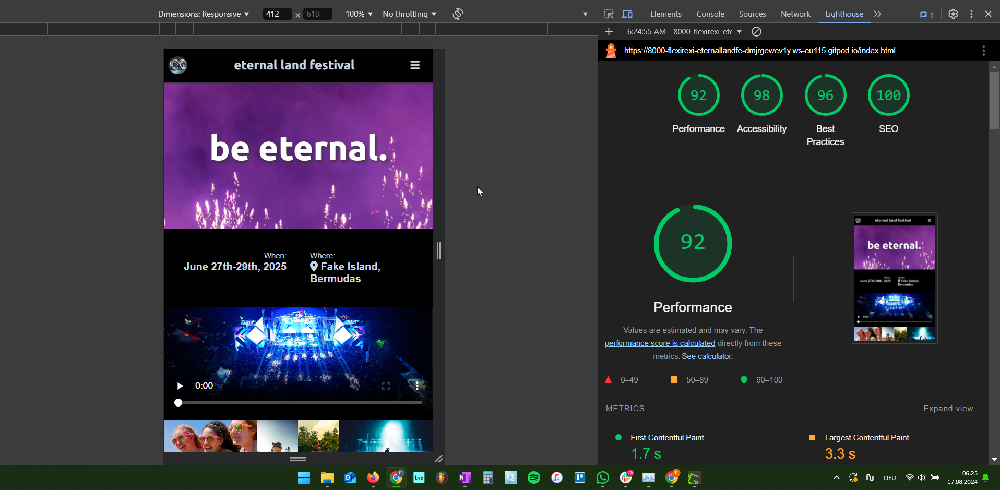
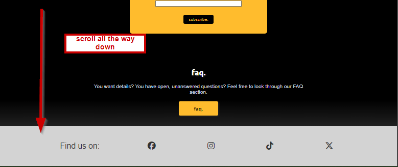

# Eternal Land Festival
(Developer: Felix Lehmann)

This website promotes the first state of an EDM Festival called "Eternal Land Festival" - in the middle of the Atlantic Ocean. Many photos and one video of the last years' events will motivate fans of electronic music to participate. For three days, world famous DJs will perform their latest sets to give the audience an unforgettable experience. The line-up on the website shall support the motivation process. It helps to decide rather quickly.  

The festival will offer VIP tickets. They are more expensive but provide more exclusivity. Usually, prospective customers choose the regular ticket over the VIP ticket when comparing them at the same time. That's why they are sold out quickly. To counteract this, the websites offers a pre-registration form for the VIP tickets. That increases the chance for the visitors to get a ticket, even if they fail to get a regular one. The motto: "I'd be willing to pay VIP tickets but I want to try purchasing a regular one first."

All other visitors, whether undecided or interested in a regular ticket, can subscribe a newsletter. 

[Live Webpage](https://flexirexi.github.io/eternal_land_festival/)

___

# Table of content

1. [User Experience](#user-experience)
   1. [Target audience](#target-audience)
   2. [User expectations](#user-expectations)
   3. [User Stories](#user-stories)
      1. [First-time user](#first-time-user)
      2. [Returning user](#returning-user)
   4. [Design](#design)
      1. [Fonts](#font)
      2. [Structure](#structure)
      3. [Wireframes](#wireframes)
2. [Technologies used](#technologies-used)
   1. [Languages](#languages)
   2. [Frameworks & tools](#frameworks-and-tools)
3. [Features](#features)
   1. [Existing features](#existing-features)
   2. [Upcoming features](#upcoming-features)
4. [Testing](#testing)
   1. [Validator testing](#validator-testing)
      1. [HTML](#html)
      2. [CSS](#css)
      3. [Performance](#performance)
      4. [Responsiveness](#responsiveness)
      5. [Accessability](#accessability)
  2. [Fixed bugs](#fixed-bugs)
  3. [Unfixed bugs](#unfixed-bugs)
  4. [User Story testing](#user-story-testing)
5. [Deployment](#deployment)
6. [Credits](#credits)
   1. [Content](#content)
   2. [Media](#media)

# User Experience
## Target audience
- fans of electronic dance music (EDM)
- loyal fans of this festival (those who visited the festival already)
- friend groups of up to 4 people for a stag party

## User expectations
- a simple website that infects the visitors with the festival vibe
- get a feeling very quickly of how the music and party will be like
- specific information (FAQ) that help to get an idea of the trip
- visual impression
- modern design that meets the zeitgeist 

## User Stories
### First-time user
*As a first-time user*
- I want to know what kind of festival that is and what I can exptect from it
- I want to know when and how long it takes place
- I want to know where it takes place
- I want to see images and videos that show me the feeling of the festival - generally, the vibe
- I want social media presence: links to tiktok, instagram (possible facebook and X)

### Returning user
*As a returning user*
- I want to know how the stay is being managed
- I want to know the latest updates for the line up
- I want to know when the official ticket sale starts
- I want detailed information about the tickets, if possible
- I want to know how I can pre-register to buy preferred VIP tickets
- I have several organisational questions that might be specific but frequently asked - I want them to be answered
- I want to subscribe to a newsletter, I am interested but not in a VIP ticket

## Design
### Fonts
Arial has been used as a neutral font without serifs.
Ubuntu font (taken from [Google fonts](https://fonts.google.com/specimen/Ubuntu)) is used for headers. It is a soft and well known sans-serif font. 

### Structure
The main page (index.html) is structured intuitively. Each section has its own screen wide block, even in desktop mode. The visitor only need to scroll up and down to consume one webpage - a mix of facts and emotions. The landing page (title image) appeals to the emotional side of the customer. The next sections don't disturb with too complex layouts, information or interactions. 

There are two complex topics by now which are presented in separate pages. The FAQ page provides many details about the ticketing, the journey and the festival. The third page provides the form where visitors can pre-register for VIP tickets. Here we need some more details. Here is a general structure of the webpages:
- index.html (home page)
   - nav bar with a pre-registration button
   - sections with occasional facts and impressions (such as title, galleries, video, short overview, ticket information, vip section, and subscription section)
   - footer with social media links
- faq.html (frequently asked questions page)
  - same nav bar as the home page with pre-registration link
  - 3 sections: information about tickets, the journey and the festival itself
  - same footer as home page
- preregistration.html (pre-registration form)
  - nav without links (the page shall not invite the visitor to go back)
  - pre-registration form with preferred choices and personal data
  - same footer as home page

### Wireframes
Although a mobile first development was applied, the wireframes show the pages more or less in desktop mode. That's because the the elements are arranged below each other in general. Only the nav bar and the ticket information are different. 

  
home (index.html)

  

  
pre-register page (preregister.html)

  

  
faq pag (faq.html)

  

# Technologies used
## Languages
- HTML
- CSS

## Frameworks and tools
- Git
- GitHub
- Gitpod
- Tinypng
- Greenshot
- Balsamiq
- wave tool
- Google Fonts
- Font Awesome
- Google Chrome dev tools

# Features
## Existing features
### Logo and Navigation bar
- fully responsive
- on all 3 pages
- in mobile size, nav items collapse into an invisible menu which can be made visible by clicking on the burger icon
- next/below the nav items, there is the pre-registration button, always ready to be clicked
- logo is a link to the home page
- the nav links only exist on the faq page and the home page, the visitor shouldn't be invited to go back from the pre-registration page 
- the nav links navigate through the section of the home page  

home nav bar collapsed:  

home nav bar expanded:

### landing page and when&where facts
- same in all sizes
- appeals to the emotions of the visitor and provides the only important information to know right now: when, where

### inspiring/motivating video and gallery
- the user can watch the previous events (aftermovie) to better estimate if the festival is interesting
- the images will give the user even more impressions of the moments at this festival

### welcome section
- the overview which welcomes the visitor only now with words
- this is for first time users who don't know this event and want to know a bit more about it

### line-up section
- this sectin tells the visitor if their favourite DJs/artists will perform there
- this is not a finished list and will be updated contineously (this is common practice otherwise we'd loos prospective customers)
- the starring DJs are on top, named separately with a higher attention

### second gallery
- a second gallery mainly to provide more variety to the webpage
- more impressions

### ticket information
- provide details about ticket conditions and overnight stay
- with this overview, the visitors can take time to think this through 
- the visitor shall feel comfortable by not having to decide now
- since this is a special festival, the visitor really should think about the airport they'd like to departure
- after all these information, the ticket sale start date is revealed
- the mobile version show the information below each other, the desktop version in a grid of 3 columns 1 row

mobile size:

desktop version:

### vip section
- the vip section states the exclusivity of purchaging a VIP ticket
- it basically is an add-on to the regular ticket, caused by the standardized process of travel and overnight stay
- the add-ons: vip area, back-stage, vip restaurant reservation
- at the bottom, the visitor can click a button which leads them to a separate page to pre-register (call to action)

### stay tuned section
- if the user decides not to register for vip tickets, we offer them to subscribe our newsletter
- they might be interested in the regular ticket 
- they might be generally interested in this festival and want to follow it first

### faq section
- all that is nice, but the visitor still has unanswered questions
- to provide many details, this section offers a link to a proper faq section

### footer
- a proper festival page needs social media links
- such event attrack young people, so, at least tiktok and instagram are necessary - facebook and X are optional
- this footer is visible on all three webpages

### faq webpage
- this page is structured in 3 sections: faq for the ticketing, for the journey and for the festival itself
- this section will be updated contineously
- many answers for the early state of this festival - to make the visitor feel safe/comfortable

### pre-register webpage
- the main reason the website exists
- here, the visitor can register for a vip ticket reservation one day before the ticket sale starts
- country is needed as the tickets will fairly be allocated to each country
- it is not binding - just a preference which will result in a higher chance of actually getting a ticket
- preferences are ticket category and departuring/arriving airport as well as the amount of tickets (up to 4)

## Upcoming features

### contineously updating the line-up
- a good organizer keeps its line-up clean otherwise you might loose customers before they are even interested in your event
- each DJ will attract their fans

### faq section update
- the closer the event is the more specific your visitors will have
- eg. which terminal at the airports, are they flying together with other guests?
- to really service the customers, a contact form should be added where visitors can ask openly

# Testing
## Validator testing
### HTML
- done using the W3C Markup validation

index.html:

faq.html:

index.html:

### CSS
- done, using the W3C CSS validation

### Performance
- index.html, faq.html and preregister.html are ok

### Responsiveness
- see responsiveness with https://ui.dev/amiresponsive?

### Accessability
- accessibility was checked with the wave tool

## Fixed Bugs

html for index.html 1:

html for index.html 2:

html for preregister.html 1:

html for preregister.html 2:

## Unfixed Bugs
- indirect bug: there must be found a way to show the landing page fully covered with an image without impacting the performance of the pageloading (in lighthouse)
- sometimes, rather random, it can happen that lighthouse measures a performance lower than 90%, even with removing all rendering blocking scripts/imports like google fonts and Font awesome. Not even the removal of the landing page image prevents that. Nevertheless, the performance most of the times above 90%.

## User Story testing
### As a first-time user..

**I want to know what kind of festival that is and what I can expect**
- Feature: welcome section
- Action: give the user a brief overview about that festival
- Expected result: the user understands that this is an electronic music festival in the atlantic ocean

[experience](docs/user_stories/us01.png)

**I want to know when and how long it takes place**
- Feature: home landing page and faq page, first header
- Action: inform the user about time and duration 
- Expected result:the user is informed 

[where it takes place](docs/user_stories/us02.png)

**I want to kow wwhere it takes place**
- Feature: landing page and faq page
- Action: inform the user about the location of the festival
- Expected result: the user is informed that this festival is on an island in the atlantic ocean

[where it takes place](docs/user_stories/us02.png)

or faq page:

 

 

**I want to see images and videos that show me the feeling  of the festival - generally, the vibe**
- Feature: gallery1, video section and gallery2
- Action: play the (aftermovie) video gather impressions from the previous events
- Expected result: the user will get an idea how this festival is like

just scroll down the main page:

**I want social media presence: links to tiktok, instagram (possibly face book and X)**
- Feature: footer
- Action: links to official social media channels to connect with other fans/the festival team
- Expected result: the user will be led to the festival's social media sites

### As a returning user...

**I want to know how the stay is being managed**
- Feature: ticket information section
- Action: information and overview of 3 possibilities to stay overnight during the festival
- Expected result: the user will be informed and can prepare for later possible ticket purchases

**I want to know the latest updates for the line-up**
- Feature: line-up section
- Action: keep the user up to date about the artists performing at this event
- Expected result: the user will know the latest status of the line-up

**I want to knwo when the official ticket sale starts**
- Feature: ticket information section
- Action: simply inform the client about the official ticket sale start 
- Expected result: the user is informed that the official sale starts on 20th Jan, 2025 while the vip ticket sale starts one day earlier

**I want detailed information about the tickets, if possible**
- Feature: ticket information section
- Action: inform the client that the ticket category is strongly connected to the overnight stay and flight
- Expected result:the client knows that tickets category is a combination of stay and flight

this information is in the same overview as how the stay is being managed:

**I want to know how I can pre-regiater to buy preferred VIP tickets**
- Feature: vip section on the home page and pre-register web page + the preregister button at the top in the nav bar
- Action: the vip section explains the VIP ticket and has a link to the vip registration form
- Expected result: the user will find the registration web page quite easily and quickly

how to get to the pre-register on the home page:

then fill the form and choose your preferred options:

**I have several organisational questions that might be specific**
- Feature: faq section at the end of the home page and the separate faq page with all information
- Action: the user will be lead to the faq web page where many questions are answered - it will contineously kept up to date
- Expected result: The user is generally provided with many details regarding the tickets, the journes and the festival itself

navigate through the main page:

then, click on the headers to expand the headers:

**I want to subscribe to a newsletter, I am interested but not in a VIP ticket**
- Feature: stay tuned section
- Action: enter name and email to register for the newsletter
- Expected result: the user will be successfully subscribed

# Deployment
The website was deployed using GitHub and GitPod
The deployment was done by GitHub and gitpod:

    In the GitHub repository navigate to the Settings tab
    On the left hand menu select Pages
    For the source select Branch: main
    After refresh you will see at the top: "Your site is published at https://flexirexi.github.io/eternal_land_festival/"

# Credits
## Content
- examples of README files ([Love Running](https://github.com/Code-Institute-Solutions/readme-template) and [Bodelschwinger Hof](https://github.com/4n4ru/CI_MS1_BodelschwingherHof/blob/master/README.md))
- Font Awesome for the icons (4 in total): https://fontawesome.com/

## Code
No code was just copied/pasted. For all problems to solve, I took help from the following websites/people and created my own solutions out of that:

gallery grid: 
by [Reyshawn](https://stackoverflow.com/users/8247439/reyshawn) on [stackoverflow](https://stackoverflow.com/questions/56720810/how-to-resize-multiple-images-side-by-side-to-to-fit-the-current-screen-size)

darken a background-image: 
by [Shin](https://stackoverflow.com/users/3518203/shin) on [stackoverflow](https://stackoverflow.com/questions/23208200/how-to-darken-a-background-using-css)

flexbox - wrap content: 
[Mozilla](https://developer.mozilla.org/en-US/docs/Web/CSS/flex-wrap)

Styling form with label above inputs: 
by [fin1te](https://stackoverflow.com/users/657830/fin1te) on [stackoverflow](https://stackoverflow.com/questions/6046110/styling-form-with-label-above-inputs)

country list for select/dropdown: 
by [Dan Rovito](https://gist.github.com/danrovito) on [github](https://gist.github.com/danrovito/977bcb97c9c2dfd3398a)

how to use details and summaries: 
[W3S](https://www.w3schools.com/tags/tag_summary.asp)

change style of hidden radiobutton + label: 
by [PSL](https://stackoverflow.com/users/1009603/psl) on [stackoverflow](https://stackoverflow.com/questions/16839747/this-css-not-working-for-radio-button-selection)

vertically center when absolute positioning: 
by [Manisha Basra](https://medium.com/@jscodelover?source=post_page-----ea3a9d0ad72e--------------------------------) on [Medium](https://medium.com/front-end-weekly/absolute-centering-in-css-ea3a9d0ad72e)

## Media
In order of appearance:
- [festival01](assets/img/festival01.jpg) by [Sebastian Ervi](https://www.pexels.com/@sebastian-ervi-866902/) on [pexels.com](https://www.pexels.com/photo/silhouette-of-people-in-front-of-stage-1763067/)
- [festival02](assets/img/festival02.jpg) by [Wendy Wei](https://www.pexels.com/@wendywei/) on [pexels.com](https://www.pexels.com/photo/purple-fireworks-effect-1190298/)
- [festival03](assets/img/festival03.jpg) by [Wendy Wei](https://www.pexels.com/@wendywei/) on [pexels.com](https://www.pexels.com/photo/people-having-a-concert-1190297/)
- [festival05](assets/img/festival05.jpg) by [Ander Garcia](https://www.pexels.com/@ander-garcia-1317358711/) on [pexels.com](https://www.pexels.com/photo/tattooed-woman-with-braids-posing-on-grass-at-festival-25016443/)
- [festival06](assets/img/festival06.jpg) by [Hamzeh Omari](https://www.pexels.com/@omari/) on [pexels.com](https://www.pexels.com/photo/a-dj-playing-music-and-audience-dancing-at-a-festival-20733818/)
- [festival09](assets/img/festival09.jpg) by [Laura Stanley](https://www.pexels.com/@lstan/) on [pexels.com](https://www.pexels.com/photo/people-in-a-concert-2147029/)
- [festival10](assets/img/festival10.jpg) by [Laura Stanley](https://www.pexels.com/@lstan/) on [pexels.com](https://www.pexels.com/photo/people-in-a-concert-2147029/)
- [festival11](assets/img/festival11.jpg) by [Danial Duarte](https://www.pexels.com/@daniel-duarte-270529097/) on [pexels.com](https://www.pexels.com/photo/crowd-enjoying-themselves-at-a-festival-14670406/)
- [festival12](assets/img/festival12.jpg) by [IslandHopper](https://www.pexels.com/@islandhopper-x-339537771/) on [pexels.com](https://www.pexels.com/photo/smiling-girls-in-sunglasses-at-holi-festival-15325734/)
- [festival13](assets/img/festival) by [Riccardo Vespa](https://www.pexels.com/@riccardo-vespa-594469796/) on [pexels.com](https://www.pexels.com/photo/back-view-of-men-playing-music-on-stage-and-the-audience-having-fun-at-a-festival-17284331/)
- [festival18](assets/img/festival) by [Wendy Wei](https://www.pexels.com/@wendywei/) on [pexels.com](https://www.pexels.com/photo/several-people-at-a-party-1540338/)

- [festival video](https://videos.pexels.com/video-files/3941287/3941287-uhd_2560_1440_30fps.mp4 ) by [Tom Fisk](https://www.pexels.com/@tomfisk/) on [pexels.com](https://www.pexels.com/video/a-drone-footage-of-an-outdoor-concert-3941287/)

